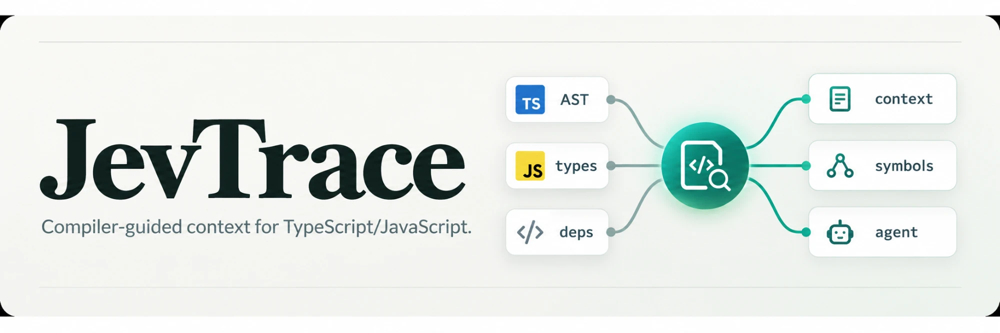
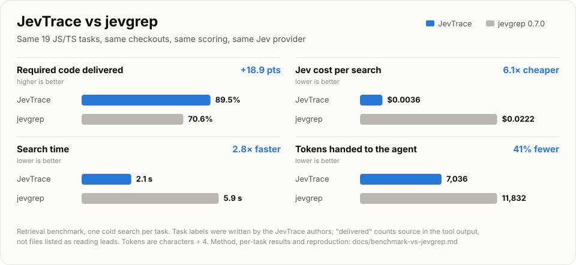

<a href="docs/benchmark-vs-jevgrep.md">
  <picture>
    <source media="(prefers-color-scheme: dark)" srcset="assets/benchmark-vs-jevgrep-dark.svg">
    
  </picture>
</a>

# JevTrace

<sub>Retrieval benchmark on 19 JS/TS tasks with labels written by the JevTrace authors — see the <a href="docs/benchmark-vs-jevgrep.md">method, per-task results and limitations</a>.</sub>

Give it a coding task; it returns the JS/TS code that task needs, within a token budget. It uses the TypeScript compiler to follow calls, types, callers and tests, and uses the Jev decision model (via OpenRouter by default) to judge relevance.

## Quick start

```bash
git clone https://github.com/123wwwa/JevTrace && cd JevTrace
npm install && npm run build
export OPENROUTER_API_KEY=your-key   # or add --offline to run without a provider
node dist/cli.js query --root /path/to/your/project --task "Fix refresh token validation"
```

As an MCP server, register `node /path/to/JevTrace/dist/cli.js --root /path/to/your/project` (stdio, with `OPENROUTER_API_KEY` set) and call `retrieve_dependency_context` with your task.

## Docs

- [Usage](docs/usage.md): CLI options, providers, MCP tools and parameters, benchmarks
- [Architecture](docs/architecture.md): how discovery, compiler expansion and ranking work, and their limits
- [Benchmark vs jevgrep](docs/benchmark-vs-jevgrep.md), [evaluation](docs/evaluation.md) and [real-task evaluation](docs/discovery-evaluation.md)

Requires Node.js 20+. MIT license.
